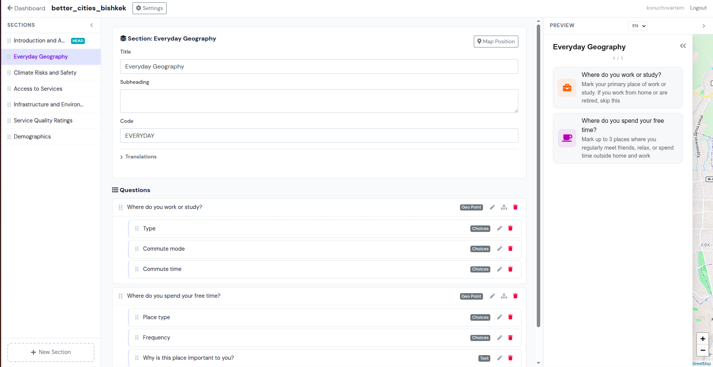
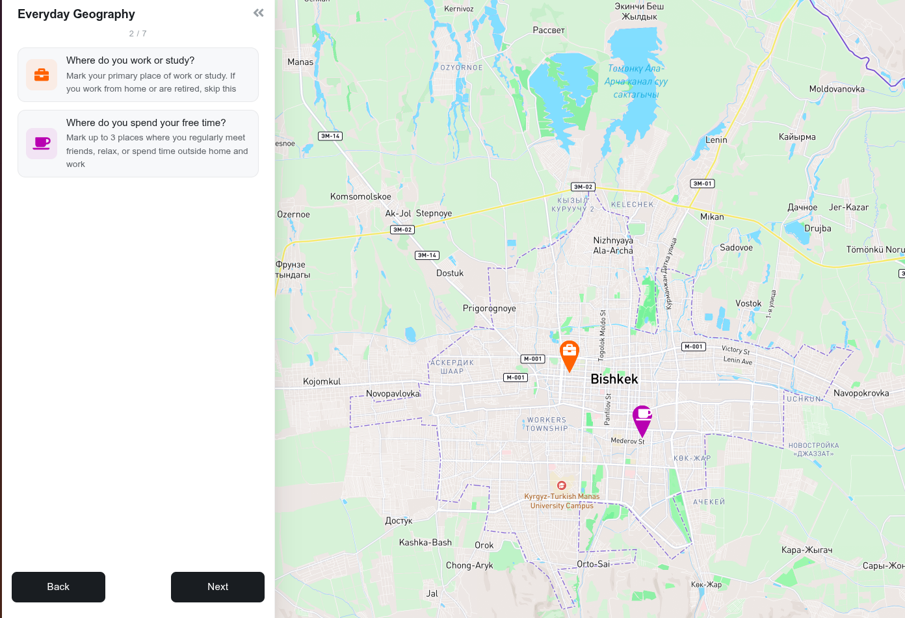
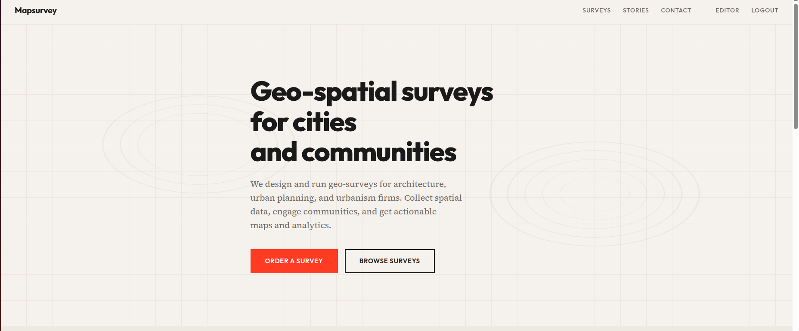

<p align="center">
  
  <h1 align="center">Mapsurvey</h1>
  <p align="center">
    Open source geospatial survey platform for cities and communities
    <br /><br />
    <a href="LICENSE"></a>
    <a href="https://www.python.org/"></a>
    <a href="https://www.djangoproject.com/"></a>
    <a href="https://postgis.net/"></a>
    <br /><br />
    <a href="https://mapsurvey.org"><strong>Cloud version &rarr;</strong></a>
    &nbsp;&middot;&nbsp;
    <a href="https://mapsurvey.org/docs">Documentation</a>
    &nbsp;&middot;&nbsp;
    <a href="https://mapsurvey.org">Landing page</a>
  </p>
</p>

<br />



Mapsurvey is a self-hostable platform for creating location-based surveys with interactive maps. Collect points, lines, and polygons from respondents alongside traditional survey questions. Built for urban planners, researchers, and civic tech teams who need spatial data from communities.

**Don't want to self-host?** Use [mapsurvey.org](https://mapsurvey.org) — the managed cloud version with zero setup.

## Features

- **13 question types** — text, number, choice, multichoice, range, rating, datetime, point, line, polygon, image, and more
- **Interactive map input** — respondents draw points, lines, and polygons on a Leaflet map with Mapbox basemaps
- **Visual survey editor** — WYSIWYG drag-and-drop editor with live preview (HTMX + SortableJS, no SPA)
- **Multi-language surveys** — full i18n support for questions, sections, choices, and thank-you pages
- **Conditional sub-questions** — hierarchical questions with parent-child relationships
- **Data export** — download responses as GeoJSON + CSV in a ZIP archive
- **Survey import/export** — share survey structure between instances via JSON
- **Mobile-friendly** — responsive forms with crosshair mode for touch-friendly point placement
- **Session tracking** — progress indicator, back-navigation with answer preservation
- **Self-hostable** — run on your own infrastructure with Docker and PostGIS



## Quick Start

### Docker (production)

```bash
git clone https://github.com/ganjasan/mapsurvey.git
cd mapsurvey
cp .env.example .env  # edit as needed
docker compose up --build
```

Open [http://localhost:8000](http://localhost:8000). An admin user is created automatically from the env vars (`admin` / `adminadmin` by default).

### Local development

Requires Python 3.9+, PostgreSQL with PostGIS, and GDAL/PROJ system libraries.

```bash
git clone https://github.com/ganjasan/mapsurvey.git
cd mapsurvey

# One command does it all: starts PostGIS, runs migrations, launches dev server
./run_dev.sh

# Or with a clean database reset:
./run_dev.sh --clean
```

This will:
1. Start a PostGIS container via Docker
2. Run database migrations
3. Create a superuser (with `--clean`)
4. Start the Django dev server at [http://localhost:8000](http://localhost:8000)

## Architecture

```
Django 4.2 + GeoDjango + PostGIS
├── Survey engine      — dynamic form generation, session management
├── Visual editor      — HTMX + SortableJS, 3-column layout
├── Data export        — GeoJSON + CSV via pandas
├── Import/export      — survey structure as JSON (ZIP)
└── Leaflet widgets    — custom draw tools for point/line/polygon input
```

### Data model

```
Organization
└── SurveyHeader (definition + UUID + translations)
    ├── SurveySection (ordered groups with map center/zoom)
    │   └── Question (13 types, inline JSON choices, sub-questions)
    └── SurveySession (respondent attempt)
        └── Answer (text, numeric, geometry, selected choices)
```

### URL structure

| Path | Description |
|------|-------------|
| `/editor/` | Dashboard for authenticated users |
| `/editor/surveys/<uuid>/` | Visual survey editor |
| `/surveys/<slug>/` | Public survey entry |
| `/surveys/<slug>/<section>/` | Survey section form |
| `/surveys/<slug>/download` | Export responses as ZIP |
| `/admin/` | Django admin |

## Management Commands

```bash
# Export a survey (structure, data, or both)
python manage.py export_survey <name> --mode=structure
python manage.py export_survey <name> --mode=data
python manage.py export_survey <name> --mode=full

# Import a survey from ZIP
python manage.py import_survey path/to/survey.zip
```

## Configuration

Mapsurvey is configured via environment variables:

| Variable | Required | Description |
|----------|----------|-------------|
| `SECRET_KEY` | Yes | Django secret key |
| `DEBUG` | No | `1` for development, `0` for production |
| `DJANGO_ALLOWED_HOSTS` | Yes | Space-separated hostnames |
| `SQL_ENGINE` | Yes | `django.contrib.gis.db.backends.postgis` |
| `SQL_DATABASE` | Yes | Database name |
| `SQL_USER` | Yes | Database user |
| `SQL_PASSWORD` | Yes | Database password |
| `SQL_HOST` | Yes | Database host |
| `SQL_PORT` | Yes | Database port |
| `DATABASE_URL` | No | Alternative to `SQL_*` vars (for PaaS like Render) |
| `MAPBOX_ACCESS_TOKEN` | No | Mapbox token for basemaps |
| `USE_S3` | No | Set to `TRUE` for S3 media storage |
| `AWS_ACCESS_KEY_ID` | No | S3 credentials |
| `AWS_SECRET_ACCESS_KEY` | No | S3 credentials |
| `AWS_STORAGE_BUCKET_NAME` | No | S3 bucket name |

## Testing

```bash
# Start PostGIS (tests use a separate test_mapsurvey database)
docker compose up -d db

# Run tests
./run_tests.sh survey -v2
```

## Comparison

| | **Mapsurvey** | **Maptionnaire** |
|---|---|---|
| Source code | Open (AGPLv3) | Proprietary |
| Self-hosting | Yes, free | No |
| Pricing | Free self-hosted, paid cloud | From ~$3,000/year |
| Map providers | Mapbox, OSM | Limited |
| Data export | GeoJSON + CSV | Vendor-dependent |
| Geo input | Point, line, polygon | Point, area |
| API/CLI | Import/export commands | Closed API |

## Cloud



For teams that don't want to manage infrastructure, [mapsurvey.org](https://mapsurvey.org) offers:

- Zero-setup deployment
- Automatic updates
- Managed backups
- Priority support

See [mapsurvey.org](https://mapsurvey.org) for plans and pricing.

## Contributing

Contributions are welcome! Please open an issue first to discuss what you'd like to change.

```bash
# Fork, clone, and set up dev environment
git clone https://github.com/<your-fork>/mapsurvey.git
cd mapsurvey
./run_dev.sh --clean
./run_tests.sh survey -v2  # make sure tests pass
```

## License

Mapsurvey is licensed under the [GNU Affero General Public License v3.0](LICENSE) (AGPLv3).

This means you can freely self-host, modify, and contribute. If you run a modified version as a network service, you must share your changes under the same license. For commercial cloud licensing, contact us at [mapsurvey.org](https://mapsurvey.org).
